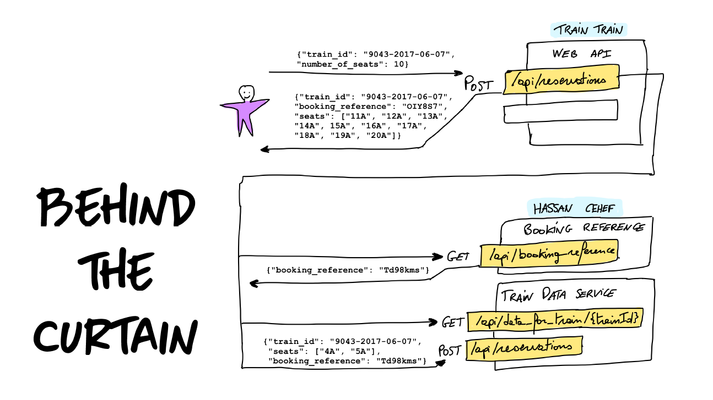

# LegacyTrain kata

__Kata for code retreat__ on how to refactor a typical legacy code-base from an anemic, procedural & bugged domain to a __DDD-style code powered by Hexagonal Architecture__.

*__Note:__ this brown-field kata has been directly inspired by Emily BACHE's __[KataTrainReservation](https://github.com/emilybache/KataTrainReservation)__ (green-field).*

# This exploreddd branch contains the result of our live coding session in Denver, September 23th 2017.
If you want to do the same kata, you can start from the situation __[in the master branch here](https://github.com/42skillz/liveCoding-LegacyTrain)__.

__[Slides are available here](https://github.com/42skillz/talk-distillCoreDomainFromLegacy/blob/master/DistillCoreDomainFromLegacy.pdf)__

## Context

__TrainTrain__ is a start-up aiming to help passengers to smoothly reserve seats on national trains via their Web API. TrainTrain system is actually __leveraging on 2 underlying Web Apis provided by the Hassan Cehef national train operator__ (to get trains topologies and to confirm seats reservations once found, and to get official booking references for those reservations).

A few months ago, a v1 of the TrainTrain.Api has been developed and released by an external consultancy but it seems that they are not interested anymore to work for the TrainTrain start-up. This is why TrainTrain has been calling __you to code the new feature they want to add on their existing system__.

### Existing business rules around seats reservations

1. For a train overall, no more than 70% of seats may be reserved in advance.
2. You must put all the seats for one reservation in the same coach.

## Objectives

### Must-have
1. __Introduce a new business rule:__
 	- *"Ideally, no individual __coach__ should have no more than 70 percent of reserved seats. This could make you and go over 70% for some coaches, just make sure to keep to 70% for the whole train."*

2.  __Understand why TrainTrain is paying recurrent penalties to the Hassan Cehef national train operator__ 

 	- Seems to be related to an exagerated number of seats reservation cancellation unless it is related to a bug...

### Nice-to-have
3. Embrace the __*[Ubiquitous Language](https://martinfowler.com/bliki/UbiquitousLanguage.html)*__ of the TrainTrain business within your code

4. Use as much as possible __DDD tactical patterns__ (e.g. *Value Types, Aggregates, Clojure of operations,* ...)

5. Get rid of dead code or useless capabilities

6. __Implement the Ports and Adapters (a.k.a. Hexagonal Architecture)__ so that the Domain code (i.e. the one with the business-logic) will remain properly isolated from the technical concerns (i.e. the cache, the http or Db calls). 
	- Set a clear separation between business code & technical one by introducing 2 differents projects: __TrainTrain.Domain__ and __TrainTrain.Infra__
	- No JSON stuffs must remain on the Domain side.
	- Introduce a completely different JSON format for another TrainTrain partner to interact with the TrainTrain.Api. Of course, the existing Web Api should remains for existing consumers. You will have to play with Ports and Adapters...

## Platform architecture

### TrainTrain & Hassan Cehef Web Apis interactions

To understand how to interact with TrainTrain or Hassan Cehef Web Apis, you can check Emily BACHE [KataTrainReservation's readme](https://github.com/emilybache/KataTrainReservation/blob/master/README.md).

## Credits
This kata has been created by __[Bruno BOUCARD](https://twitter.com/brunoboucard/)__, __[Jérémie GRODZISKI](https://twitter.com/jgrodziski/)__ and __[Thomas PIERRAIN](https://twitter.com/tpierrain/)__ for an exceptional __DDD Paris event__ of 4 hours hosted at Microsoft France June 7th 2017. Vidéos (in french) with the keynote and the 3 live-coding sessions are available __[here on youtube](https://www.youtube.com/channel/UCyqzNZFVOwc8paEVn-wtdpg)__.

__Note:__ the domain (including samples, contraints and invariants) has been directly inspired by Emily BACHE green-field: __[KataTrainReservation](https://github.com/emilybache/KataTrainReservation)__.
